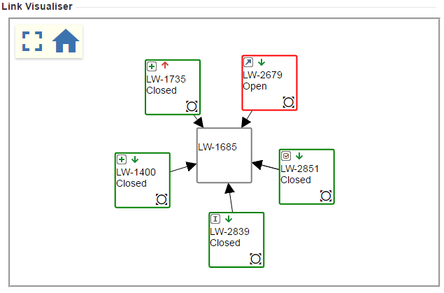

PLEASE NOTE: This project is not updated, has not been updated in a while and very likely does not work anymore. 

# Jira Issue Link Visualiser

A Chrome extension that will add an issue link visualisation on the right hand pane when in Atlassian Jira. Requires the REST API to be enabled in JIRA to work!

# Why I built this?
 One day whilst working on an issue I had trouble keeping track of the status of related issues and sub issues without scrolling. This is my attempt at making a visual aid for issue links.

# How to install

Easy:
* Go to the Chrome Extension store and install it [here](https://chrome.google.com/webstore/detail/jira-issue-link-visualise/blhhnohbefoaoibbacoodpdgcmdnbkaa)

Or:
* Clone this repository to a directory on your computer
* In Chrome go to Settings>Extensions and enable "Developer Mode"
* Click "Load unpacked extension..." and open the directory where you cloned this repository

# How to use
 Go to https://adamstraube.github.io/a-better-way-of-viewing-links-between-issues-in-jira/ for more information.

## Built with
* [Jquery](https://github.com/jquery/jquery)
* [VivaGraphJS](https://github.com/anvaka/VivaGraphJS/)
* [Material icons](https://material.io/icons/)

## Todo:
- [X] Screen centring and zoom on main issue
- [ ] Sprint
- [ ] Epic or Epic Link
- [ ] Age of issue?
- [ ] Issue activity (Number of comments?)
- [X] Fullscreen function
- [X] Collapse module if no issue links found
